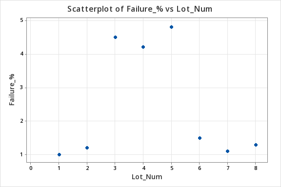
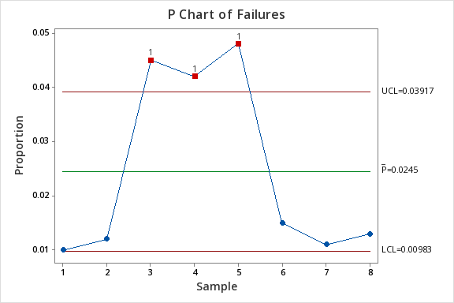
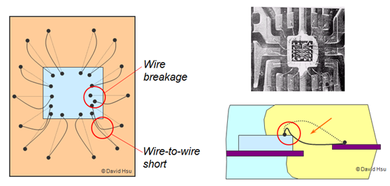

# 🔬 Wire Bond Failure Analysis During the Molding Process

This project presents a data-driven case study to analyze yield loss in semiconductor packaging and identify the most probable root cause using structured engineering thinking.

---

## Problem Statement

- Increase in failure rate observed after the molding process  
- Failures detected during final electrical testing  
- Objective is to identify:
  - Where the failure is introduced in the process flow  
  - The most probable root cause using data and engineering analysis  

---

## Creating and Analyzing the Dataset (Data-Driven Thinking)

Before moving to physical failure analysis, the problem is first approached from a **data perspective**, as yield issues in a real OSAT environment are always identified through production data.

Since actual factory data is not available, a **simulated production-like dataset** is created to mimic real lot-wise manufacturing behavior.

---

### Dataset Characteristics

- Constant units per lot: **1000 units**
- Stable baseline failure rate: **~1%**
- Sudden increase in failure rate: **~4–5%**
- Recovery to baseline, indicating process correction

---

### Dataset 

| Lot | Units Tested | Failures | Failure % |
|-----|-------------|----------|----------|
| L1  | 1000        | 10       | 1.00%    |
| L2  | 1000        | 12       | 1.20%    |
| L3  | 1000        | 45       | 4.50%    |
| L4  | 1000        | 42       | 4.20%    |
| L5  | 1000        | 48       | 4.80%    |
| L6  | 1000        | 15       | 1.50%    |
| L7  | 1000        | 11       | 1.10%    |
| L8  | 1000        | 13       | 1.30%    |

---

### Failure Trend Analysis

*Figure: Failure Rate (%) vs Lot showing a sharp increase between Lot L3–L5, indicating a process excursion.*

---

## SPC Analysis (P-Chart)
A P-chart was used to monitor process stability and evaluate variation in failure rates across production lots.

SPC analysis (P-chart) was performed using *Minitab* to align with standard manufacturing practices.

The chart indicates that the process goes out of control after Lot L3, suggesting the presence of a special cause variation rather than normal process fluctuation.

*Figure: P-chart showing Lots L3–L5 exceeding the upper control limit (UCL), confirming the process was out of control.*

---

## Key Observations

- Lots **L1–L2** show stable failure rate (~1%) → normal process  
- Lots **L3–L5** show significant increase (~4–5%) → abnormal condition  
- Lots **L6–L8** return to baseline → process recovery  

---

## Engineering Interpretation

- Gradual variation → normal fluctuation  
- Sudden increase → **process excursion**  

The observed trend indicates that:

> The failure is not random and is linked to a temporary change in process conditions starting from Lot L3.

---

## Engineering Approach

The problem is approached using a structured yield engineering methodology rather than assuming the root cause directly.

- Failure data from ATE is analyzed to identify failure type (open/short/intermittent)  
- Failure stage is determined by correlating test results with process flow  
- For open failures, possible mechanisms such as wire break or mechanical stress are evaluated  
- Process conditions during molding (pressure and compound flow) are analyzed for their impact on bond wires  

### Key Insight

> The analysis follows a step-by-step approach: failure type → process stage → physical mechanism → process correlation, leading to identification of the most probable root cause.

## Understanding the Failure Type

The first step after detecting yield loss is to analyze ATE test logs to identify the nature of the failure.

- Open failure → High resistance or no current flow  
- Short failure → Unintended current flow  
- Intermittent failure → Unstable electrical behavior  

From the ATE data, the failure is identified as an **open circuit**, indicating a break in the electrical path within the package.

### Possible Locations for Open Failure

- Die attach (die-to-substrate connection)  
- Bond wire (wire break or weak bond)  
- Substrate routing  
- Solder joint (ball attach)  

### Key Focus

Since this is a wire-bonded package, the bond wire is the most critical area because:

- It is mechanically fragile  
- It is exposed to molding stress  
- It is a common failure point in assembly  

### Engineering Insight

> Based on failure type and package structure, bond wire integrity is considered the most probable area of concern, but further analysis is required to identify the exact stage of failure.

## Identifying the Failure Stage

After identifying the failure as an open circuit, the next step is to determine at which stage it is introduced in the assembly flow.

Process flow considered:
Wafer → Die Attach → Wire Bond → Molding → Ball Attach → Final Test

### Stage Correlation

- Units pass earlier stages (die attach, wire bonding)  
- Failure appears only at final test (post-molding)  

This indicates that the defect is introduced after wire bonding.

### Evaluation of Possible Stages

- **Bonding stage** → Eliminated (failures would appear earlier)  
- **Ball attach** → Less likely (primarily affects solder joints)  
- **Handling** → Typically random, not consistent across lots  
- **Molding** → High pressure, temperature, and compound flow can introduce mechanical stress  

### Key Insight

> Molding is the first process where external mechanical forces act on bond wires, making it the most probable stage for failure introduction.

### Conclusion

> Based on process correlation and elimination logic, the failure is most likely introduced during the molding process.

## Root Cause Mechanism (Wire Sweep)

After identifying molding as the stage where the failure is introduced, the next step is to understand the physical mechanism causing wire break.

### Molding Conditions

During molding, the package is exposed to:

- High pressure  
- High temperature  
- Flow of epoxy molding compound  

This is the first stage where external forces act on bond wires.

---

### Failure Mechanism

Bond wires are thin, mechanically delicate, and suspended in a loop structure, making them vulnerable to external forces.

During molding:

- Mold compound flows at high velocity  
- Flow exerts force on bond wires  
- Wires get displaced sideways (**wire sweep**)  
- Mechanical stress builds, especially near the bond neck  
- Additional stress occurs during cooling due to thermal effects  

This can weaken or break the wire, leading to open circuit failure.

---
#### Visual Representation

### Critical Factors

- High molding pressure  
- Excessive loop height  
- Low wire strength  
- High flow velocity or unfavorable flow direction  

---

### Validation Indicators

If physically analyzed, the following may be observed:

- X-ray → displaced or broken wires  
- SEM → fracture or necking at bond region  
- Optical inspection → wire deformation  

---

### Key Insight

> Wire sweep during molding introduces mechanical stress on bond wires, which can lead to delayed or immediate wire break, resulting in open circuit failures.

## Final Understanding

The failure mechanism is attributed to **wire sweep during the molding process**, where mold compound flow causes mechanical displacement of bond wires. This leads to stress concentration (especially at the neck region) and eventual wire fracture, resulting in open circuit failure.

### Summary

- Molding introduces:
  - High pressure  
  - High temperature  
  - Mold compound flow  

- Bond wires are:
  - Thin and mechanically fragile  

- Mold flow causes:
  - Lateral displacement of wires (**wire sweep**)  

- Stress concentration occurs at:
  - Bond neck region  

- Additional stress during:
  - Cooling due to thermal mismatch  

### Final Result

> Wire break → Open circuit failure

## Root Cause Confirmation & Validation

After identifying wire sweep during molding as the most probable root cause, the next step is to validate it using data and controlled analysis.

### 1. Process Data Correlation

Compare process parameters across lots:

- Stable lots (L1–L2) vs high-failure lots (L3–L5)  
- Key parameters: molding pressure, temperature, and machine settings  

> If parameter variation aligns with failure increase, it supports the hypothesis.

---

### 2. Physical Validation

- **X-ray** → Check for wire displacement or breakage  
- **SEM / Cross-section (if available)** → Observe fracture or necking  

> Expected: Evidence of wire deformation consistent with wire sweep.

---

### 3. Controlled Experiment (DOE)

- Reduce molding pressure  
- Optimize loop height  

> If failure rate decreases significantly, it confirms molding-induced wire sweep as the root cause.

---

### 4. Trend Monitoring

- Track failure rate in subsequent lots  
- Ensure stability (~1% baseline)  

> Consistent improvement confirms process stabilization.

---

### Final Validation Logic

> If process parameter change → corresponding change in failure rate,  
> the identified parameter is confirmed as the root cause.

## Root Cause Confirmation & Process Improvement

Based on failure stage correlation, mechanism analysis, and process parameter evaluation, the root cause is identified as:

### Root Cause
Wire sweep during the molding process caused by:
- Excessive molding pressure  
- Suboptimal wire loop height  

This leads to mechanical stress on bond wires, resulting in wire break and open circuit failure.

---

### Corrective Actions
- Optimize molding pressure  
- Reduce wire loop height  
- Improve process control and monitoring  

---

### Result & Validation
- Failure rate increased to ~4–5% (Lots L3–L5) due to process excursion  
- After corrective actions, reduced to ~1–1.5% from Lot L6 onwards  

This confirms successful process stabilization.

---

### Final Insight

> The trend represents a typical yield excursion followed by recovery, validating molding-induced wire sweep as the root cause and confirming the effectiveness of the implemented process improvements.

## Root Cause Conclusion

Based on:

- Failure stage correlation  
- Physical mechanism analysis  
- Process parameter comparison  
- Validation through controlled adjustments  

### Conclusion

The root cause of the observed failure is identified as **wire sweep during the molding process**, primarily caused by:

- Excessive molding pressure  
- Suboptimal wire loop height  

This results in mechanical stress on bond wires, leading to wire break and open circuit failure.

---

### Corrective Action & Result

After optimizing molding pressure and reducing loop height (simulated scenario):

- Failure rate reduced from ~4–5% (Lots L3–L5)  
- Restored to ~1–1.5% from Lot L6 onwards  

This indicates successful process stabilization and confirms the identified root cause.

---

## References

The analysis is based on standard semiconductor packaging principles and commonly observed failure mechanisms.

- Fundamentals of Microsystems Packaging — Rao R. Tummala  
- NPTEL Electronics Systems Packaging — Prof. K. N. Bhat  
- Microelectronics Packaging Handbook — Rao R. Tummala  
- Microelectronics Failure Analysis Desk Reference — ASM International  

*Note: Illustrative concepts are derived from standard packaging literature and publicly available educational resources.*

## Detailed Analysis

A detailed step-by-step analysis, including data evaluation, failure mechanism, and root cause validation, is documented in the full report:

📄 [View Full Analysis](analysis.pdf)